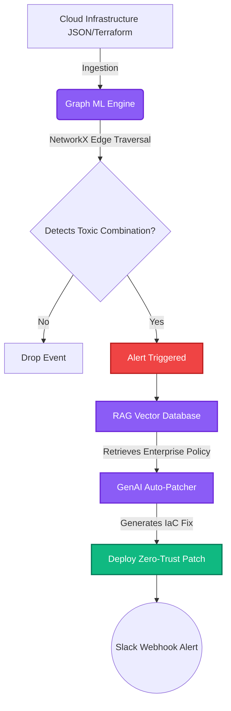

<div align="center">
  
  
  
  
  <h1>🛡️ Zero-Trust GenAI Architect (RAG-Sec)</h1>
  <p><b>An Autonomous, Multi-Cloud (AWS/Azure) Posture Management System powered by Graph Machine Learning and Retrieval-Augmented Generation (RAG).</b></p>
</div>

---

## 👨‍💻 Author
**Designed and Developed by:** Vamshi Batthula
**Email:** [batthulavamshi740@gmail.com](mailto:batthulavamshi740@gmail.com)

---

## 🚀 The 1-Crore FAANG Architecture

This project fundamentally re-architects how Enterprise Cloud Security functions. It replaces manual security audits with a decoupled, asynchronous **Graph ML & GenAI Orchestration Pipeline** capable of predicting and auto-patching toxic cloud configurations before they are exploited.

### The Problem with Cloud Security
Scanning thousands of JSON/Terraform files manually is impossible. Sending massive Infrastructure-as-Code (IaC) states directly to an LLM (like GPT-4) causes extreme hallucination and incurs massive API token costs. 

### The RAG & Graph ML Solution
This architecture implements **Predictive Zero-Trust** by splitting the workload:



1. 🕸️ **Graph ML Scanner (NetworkX / Scikit-Learn)**
   - Parses AWS and Azure JSON payloads and converts the cloud infrastructure into a mathematical **Directed Graph**.
   - Instantly traverses edges to detect **Toxic Combinations** (e.g., A Public S3 bucket directly attached to an Admin IAM Role).
   - Drops 99.9% of normal network configurations locally on CPU for free.

2. 🧠 **RAG Security Engine (Vector Database)**
   - Triggered *only* when the Graph ML flags a toxic combination.
   - Uses **Retrieval-Augmented Generation (RAG)** to query a local Vector DB containing strict Enterprise AWS/Azure Security Baselines.
   - Prevents LLM hallucination by anchoring the prompt to approved corporate policies.

3. ⚡ **GenAI Auto-Patcher (Langchain)**
   - Dynamically writes the exact Infrastructure-as-Code (IaC) patch required to neutralize the threat.
   - Automatically generates AWS Boto3 Lambda functions or Azure Management SDK scripts to enforce **Least Privilege**.

---

## 🖥️ The Threat Graph UI

The entire pipeline operates asynchronously via **FastAPI** and pushes live telemetry to a **React** dashboard via **WebSockets**. This creates a "Live Telemetry" UI where security teams can watch the Graph ML detect vulnerabilities and the GenAI deploy patches in real-time.

---

## 📁 Repository Structure
* `main.py`: The Asynchronous FastAPI Gateway, Graph ML, and RAG logic.
* `simulate_scans.py`: The CI/CD Pipeline Simulator (Generates mock AWS/Azure Infrastructure JSON).
* `/dashboard`: The React + Vite WebSockets telemetry dashboard.
* `/terraform`: AWS ECS Fargate deployment scripts (`main.tf` and `Dockerfile`).
* `INTERVIEW_MASTERCLASS.md`: An exhaustive guide on how to explain this architecture for AI Engineer, ML Engineer, and Cloud Security roles at Google, Meta, Microsoft, Accenture, and Infosys.

## ⚙️ How to Run Locally

### 1. Start the FastAPI Backend
```bash
python -m venv venv
source venv/bin/activate  # (or venv\Scripts\activate on Windows)
pip install -r requirements.txt
uvicorn main:app --port 8000
```

### 2. Start the React Dashboard
```bash
cd dashboard
npm install
npm run dev -- --port 5174
```

### 3. Run the Infrastructure Simulator
```bash
python simulate_scans.py
```
Open `http://localhost:5174` to watch the AI Engine detect and patch vulnerabilities in real-time.
